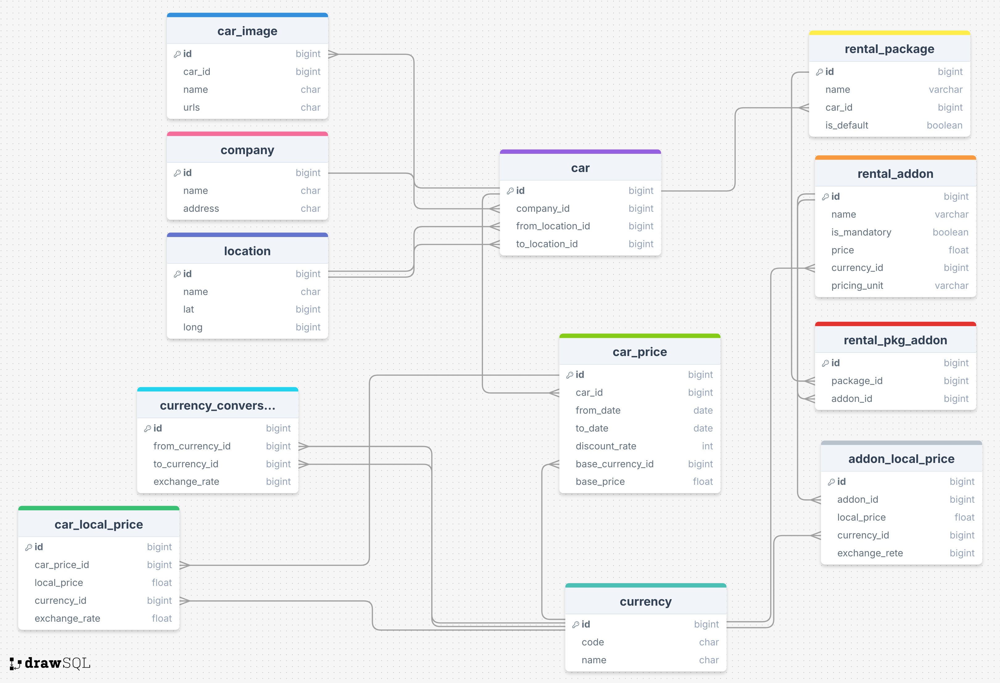

# The Art of Django ORM Optimization

## Project Setup

- Clone the repository
```bash
git clone https://github.com/milon19/orm-optim.git
```
- Create a postgres database
```bash
psql -U postgres -c "CREATE DATABASE <dbname>"
```
- Go the project directory
```bash
cd orm-optim
```
- Create a file named `.env` in the project root directory and add the following lines

> Note: Replace `<username>` and `<password>` with your postgres username and password. 
> See `.env.example` file for reference

```dotenv
SECRET_KEY=super-insecure-django-key
DEBUG=True
ALLOWED_HOSTS=*

DB_HOST=localhost
DB_PORT=5432
DB_NAME=<dbname>
DB_USERNAME=<username>
DB_PASSWORD=<password>
```

- Create a virtual environment
```bash
virtualenv <name>
```

- Activate the virtual environment
```bash
source <name>/bin/activate
```
- Install the dependencies
```bash
pip install -r requirements/local.txt
```
- Run the migrations
```bash
python manage.py migrate
```

- Run the server
```bash
python manage.py runserver
```

- Run management commands to populate the data.
```bash
python manage.py generate_sample_data
```

- Create a django application (if needed)
```bash
mkdir apps/<app_name>
python manage.py startapp <app_name> apps/<app_name>
```

## Introduction

A car rental company needs to build a system where rental companies can list their cars with dynamic pricing across multiple currencies. The system needs to handle weekly pricing, multiple images per car, various rental packages, and additional addons.

### Core Business Points
- Rental companies can list their cars, providing details like location, features etc.
- Rental companies can set weekly pricing for their cars.
- Rental companies can set multiple images for their cars.
- Rental companies can set various rental packages for their cars.
- Rental companies can set additional addons for rental packages.

### Database Models


## Tasks

  - [ ] **Task 1**: Implement an API endpoint to list all the cars. [details.](task1.md)
    